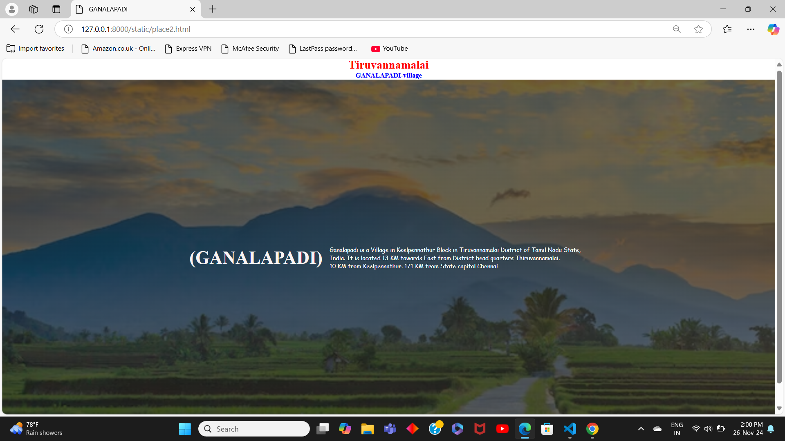
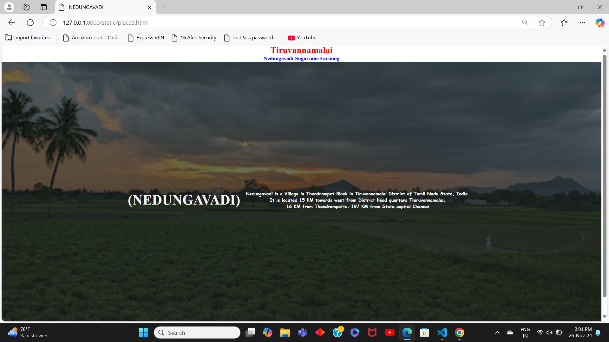
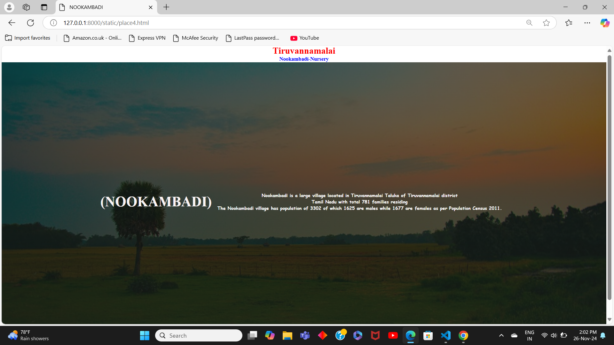
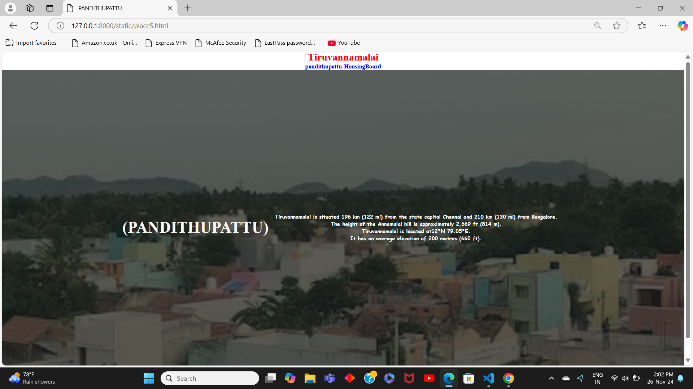

# Ex04 Places Around Me
## Date: 25-11-2024

## AIM
To develop a website to display details about the places around my house.

## DESIGN STEPS

### STEP 1
Create a Django admin interface.

### STEP 2
Download your city map from Google.

### STEP 3
Using ```<map>``` tag name the map.

### STEP 4
Create clickable regions in the image using ```<area>``` tag.

### STEP 5
Write HTML programs for all the regions identified.

### STEP 6
Execute the programs and publish them.

## CODE
```
google.html

 <!DOCTYPE html>
<html lang="en">
<head>
    <meta charset="UTF-8">
    <meta name="viewport" content="width=device-width, initial-scale=1.0">
    <title>Document</title>
</head>
<body>
    <h1 align="center">
        <font color="red"> 
            <b>Tiruvannamalai</b>
        </font>
    </h1>
    <h3 align="center">
        <font color="blue">
            <b>Parveen Sulthana J(24900218)</b>
        </font>
    </h3>
    <div class="container">
        <div class="container">
            <!-- Image Map Generated by http://www.image-map.net/ -->


<map name="image-map">
    <area target="" alt="tiruvannamalai" title="tiruvannamalai" href="http://127.0.0.1:8000/static/place1.html" coords="560,540,692,531,706,600,575,601" shape="poly">
    <area target="" alt="pandithupattu" title="pandithupattu" href="http://127.0.0.1:8000/static/place5.html" coords="311,590,432,586,432,644,315,652" shape="poly">
    <area target="" alt="nedungavadi" title="nedungavadi" href="http://127.0.0.1:8000/static/place3.html" coords="103,482,218,481,210,529,113,531" shape="poly">
    <area target="" alt="ganaladi" title="ganaladi" href="http://127.0.0.1:8000/static/place2.html" coords="900,301,994,299,992,359,912,362" shape="poly">
    <area target="" alt="nookambadi" title="nookambadi" href="http://127.0.0.1:8000/static/place4.html" coords="800,210,902,210,902,267,813,270" shape="poly">
</map>
        </div>
    </div>
</body>
</html>

place1.html

<!DOCTYPE html>
<html lang="en">
<head>
    <meta charset="UTF-8">
    <meta name="viewport" content="width=device-width, initial-scale=1.0">
    <title>TIRUVANNAMALAI</title>
    <style>
        *{
            margin: 0;
            padding: 0;
        }
        .full{
            background: linear-gradient(rgba(14, 22, 17, 0.605),rgba(30, 33, 30, 0.7)),url(tiruvanna\ malai.jpg);
            background-size: cover  ;
            background-position: center;
            height: 100vh;
            display: flex;
            justify-content: center;
            align-items: center;
            color: #fff;
}
        
        .head{
            text-align: center;
            font-size: 50px;
            color: rgb(249, 244, 244);
        }
        .content{
            padding: 20px;
            font-family: cursive;
            font-size: medium;
        }
    </style>
</head>
<body>
    <h1 align="center">
        <font color="red"> 
            <b>Tiruvannamalai</b>
        </font>
    </h1>
    <h3 align="center">
        <font color="blue">
            <b>Tiruvannamalai-DeepamTemple</b>
        </font>
    </h3>
    <div class="full">
        <div class="head">
        <b>(TIRUVANNAMALAI)</b>
        </div>
        <div class="content">
            <p>Tiruvannamalai is situated 196 km (122 mi) from the state capital Chennai and 210 km (130 mi) from Bangalore.<br> 
               The height of the Annamalai hill is approximately 2,669 ft (814 m).<br>
               Tiruvannamalai is located at12°N 79.05°E.<br>
               It has an average elevation of 200 metres (660 ft).</p>
        </div>
    </div>
</body>
</html>

place2.html

<!DOCTYPE html>
<html lang="en">
<head>
    <meta charset="UTF-8">
    <meta name="viewport" content="width=device-width, initial-scale=1.0">
    <title>GANALAPADI</title>
    <style>
        *{
            margin: 0;
            padding: 0;
        }
        .full{
            background: linear-gradient(rgba(14, 22, 17, 0.605),rgba(30, 33, 30, 0.7)),url(ganalpadi.avif);
            background-size: cover  ;
            background-position: center;
            height: 100vh;
            display: flex;
            justify-content: center;
            align-items: center;
            color: #fff;
}
        
        .head{
            text-align: center;
            font-size: 50px;
            color: rgb(249, 244, 244);
        }
        .content{
            padding: 20px;
            font-family: cursive;
            font-size: medium;
        }
    </style>
</head>
<body>
    <h1 align="center">
        <font color="red"> 
            <b>Tiruvannamalai</b>
        </font>
    </h1>
    <h3 align="center">
        <font color="blue">
            <b>GANALAPADI-village</b>
        </font>
    </h3>
    <div class="full">
        <div class="head">
        <b>(GANALAPADI)</b>
        </div>
        <div class="content">
            <p>Ganalapadi is a Village in Keelpennathur Block in Tiruvannamalai District of Tamil Nadu State,<br>
                India. It is located 13 KM towards East from District head quarters Thiruvannamalai.<br>
                10 KM from Keelpennathur. 171 KM from State capital Chennai</p>
        </div>
    </div>
</body>
</html>

place3.html

<!DOCTYPE html>
<html lang="en">
<head>
    <meta charset="UTF-8">
    <meta name="viewport" content="width=device-width, initial-scale=1.0">
    <title>NEDUNGAVADI</title>
    <style>
        *{
            margin: 0;
            padding: 0;
        }
        .full{
            background: linear-gradient(rgba(14, 22, 17, 0.605),rgba(30, 33, 30, 0.7)),url(nedungavadi.jpg);
            background-size: cover  ;
            background-position: center;
            height: 100vh;
            display: flex;
            justify-content: center;
            align-items: center;
            color: #fff;
}
        
        .head{
            text-align: center;
            font-size: 50px;
            color: rgb(249, 244, 244);
        }
        .content{
            padding: 20px;
            font-family: cursive;
            font-size: medium;
        }
    </style>
</head>
<body>
    <h1 align="center">
        <font color="red"> 
            <b>Tiruvannamalai</b>
        </font>
    </h1>
    <h3 align="center">
        <font color="blue">
            <b>Nedungavadi-Sugarcane Farming</b>
        </font>
    <div class="full">
        <div class="head">
        <b>(NEDUNGAVADI)</b>
        </div>
        <div class="content">
            <p>Nedungavadi is a Village in Thandrampet Block in Tiruvannamalai District of Tamil Nadu State, India.<br>
            It is located 15 KM towards west from District head quarters Thiruvannamalai.<br> 
            16 KM from Thandrampattu. 197 KM from State capital Chennai</p>
        </div>
    </div>
</body>
</html>

place4.html
<!DOCTYPE html>
<html lang="en">
<head>
    <meta charset="UTF-8">
    <meta name="viewport" content="width=device-width, initial-scale=1.0">
    <title>NOOKAMBADI</title>
    <style>
        *{
            margin: 0;
            padding: 0;
        }
        .full{
            background: linear-gradient(rgba(14, 22, 17, 0.605),rgba(30, 33, 30, 0.7)),url(nookambadi.jpg);
            background-size: cover  ;
            background-position: center;
            height: 100vh;
            display: flex;
            justify-content: center;
            align-items: center;
            color: #fff;
}
        
        .head{
            text-align: center;
            font-size: 50px;
            color: rgb(249, 244, 244);
        }
        .content{
            padding: 20px;
            font-family: cursive;
            font-size: medium;
        }
    </style>
</head>
<body>
    <h1 align="center">
        <font color="red"> 
            <b>Tiruvannamalai</b>
        </font>
    </h1>
    <h3 align="center">
        <font color="blue">
            <b>Nookambadi-Nursery</b>
        </font>
    <div class="full">
        <div class="head">
        <b>(NOOKAMBADI)</b>
        </div>
        <div class="content">
            <p>Nookambadi is a large village located in Tiruvannamalai Taluka of Tiruvannamalai district<br>
                Tamil Nadu with total 781 families residing<br>
                 The Nookambadi village has population of 3302 of which 1625 are males while 1677 are females as per Population Census 2011.</p>
        </div>
    </div>
</body>
</html>

place5.html

<!DOCTYPE html>
<html lang="en">
<head>
    <meta charset="UTF-8">
    <meta name="viewport" content="width=device-width, initial-scale=1.0">
    <title>PANDITHUPATTU</title>
    <style>
        *{
            margin: 0;
            padding: 0;
        }
        .full{
            background: linear-gradient(rgba(14, 22, 17, 0.605),rgba(30, 33, 30, 0.7)),url(pandithupattu.jpg);
            background-size: cover  ;
            background-position: center;
            height: 100vh;
            display: flex;
            justify-content: center;
            align-items: center;
            color: #fff;
}
        
        .head{
            text-align: center;
            font-size: 50px;
            color: rgb(249, 244, 244);
        }
        .content{
            padding: 20px;
            font-family: cursive;
            font-size: medium;
        }
    </style>
</head>
<body>
    <h1 align="center">
        <font color="red"> 
            <b>Tiruvannamalai</b>
        </font>
    </h1>
    <h3 align="center">
        <font color="blue">
            <b>pandithupattu-HousingBoard</b>
        </font>
    <div class="full">
        <div class="head">
        <b>(PANDITHUPATTU)</b>
        </div>
        <div class="content">
            <p>Tiruvannamalai is situated 196 km (122 mi) from the state capital Chennai and 210 km (130 mi) from Bangalore.<br> 
               The height of the Annamalai hill is approximately 2,669 ft (814 m).<br>
               Tiruvannamalai is located at12°N 79.05°E.<br>
               It has an average elevation of 200 metres (660 ft).</p>
        </div>
    </div>
</body>
</html>
```

## OUTPUT








## RESULT
The program for implementing image maps using HTML is executed successfully.
